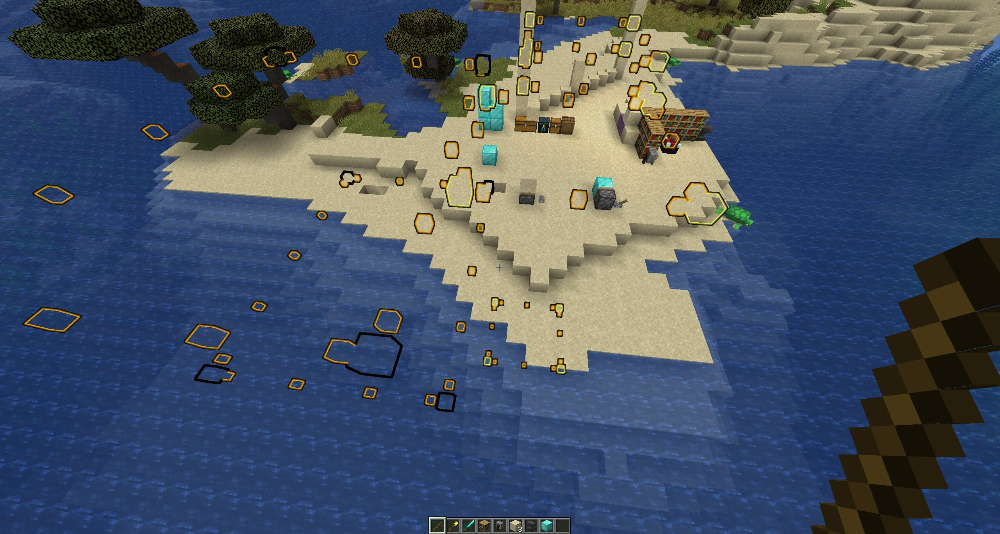
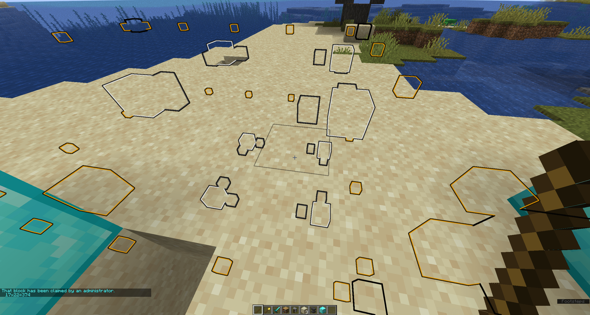

## GPBlockHighlightBoundaries

## About

GPBlockHighlightBoundaries is an addon that overrides GriefPrevention's visualization system, replacing it with more visible and less obstructive highlights.

## Features

* Displays actual bottom edge of claims in addition to visualization location
* Visualize through walls/underground more easily
* Customizable display settings and colors

## Requirements

GPBHB relies on protocol-based client-side visualizations. As a result, to keep it from being too heavily dependent on the server implementation, you must install either [ProtocolLib](https://github.com/dmulloy2/ProtocolLib) or [PacketEvents](https://github.com/retrooper/packetevents). GriefPrevention is also required.

If both are installed, ProtocolLib will be preferred - PacketEvents does not support all configuration options.

## Limitations

GPBHB leverages the Glowing effect or the debug block depending on your settings.
Bedrock clients do not have either of these features.

GPBHB will automatically ignore users from Geyser if Floodgate is installed,
but if you are using another proxy, claims may not appear at all for Bedrock players.

## Samples:

`FLAT` area visualization using `GLOWING_ENTITY`:

`FLAT` visualization of an admin claim with a subclaim using `GLOWING_ENTITY`:
